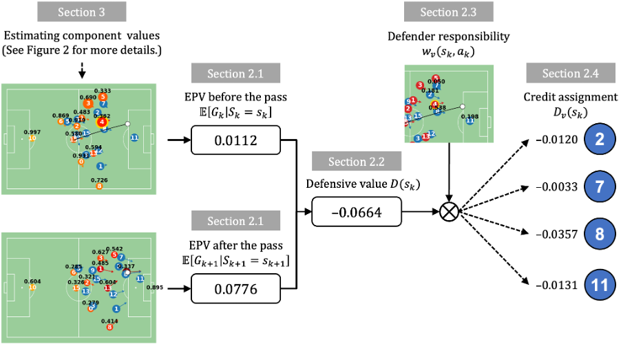
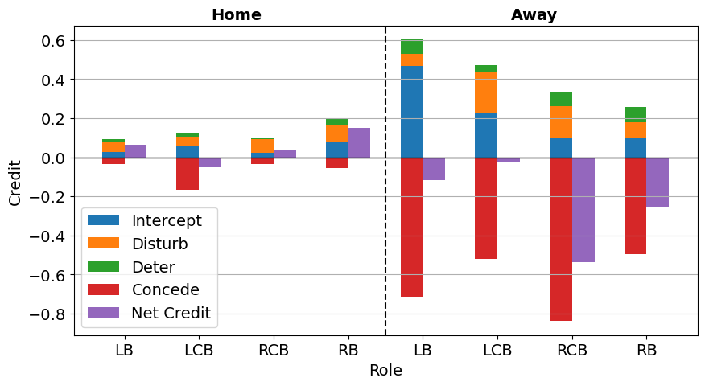
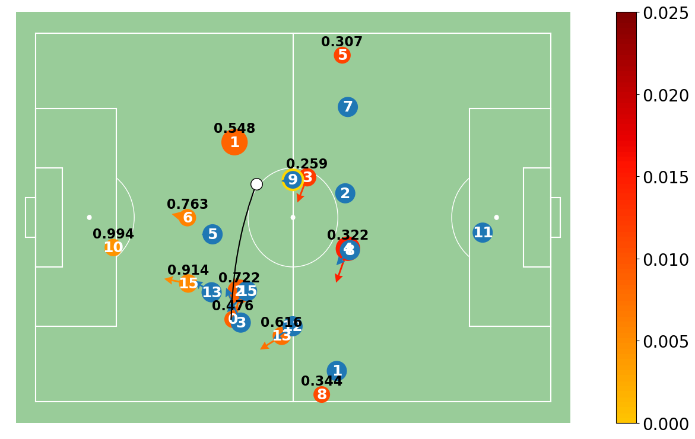
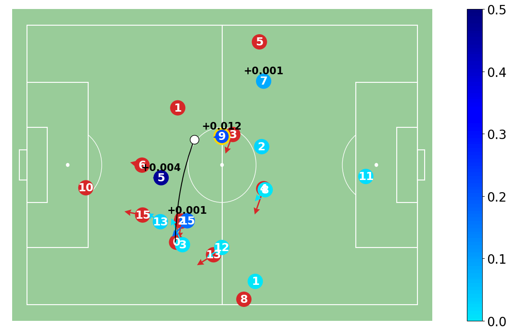

<div align="center">
	<h1>
		DEFCON
	</h1>
</div>

Source code for the paper [Better Prevent than Tackle: Valuing Defense in Soccer Based on Graph Neural Networks](https://arxiv.org/abs/2512.10355) by Kim et al., 2025 (under review).

## Introduction
**DEFCON (DEFensive CONtribution evaluator)** is a framework for evaluating the defensive contribution of soccer players in terms of reducing the Expected Possession Value (EPV) of the opposing team in a given situation.

<p align="center">
  
</p>

## Data Availability and Preparation
This codebase requires tracking data in the [Kloppy](https://kloppy.pysport.org) format and event data in the [SPADL (Decroos et al., 2019)](https://socceraction.readthedocs.io/en/latest/documentation/spadl/spadl.html) format.

The dataset used in this project cannot be publicly released, as it is an internal asset of AFC Ajax. However, users can apply DEFCON to their own datasets by following the same data format.

The current implementation assumes the following directory structure:
- Tracking data: per-match Parquet files in `data/ajax/tracking/`
- Event data: Per-match Parquet files at `data/ajax/event_synced/`
- Match lineups: A single parquet file at `data/ajax/lineup/line_up.parquet`

### 1. Tracking Data Preprocessing
Running the following command performs preprocessing on the raw Kloppy-format tracking data.
```
python datatools/preprocess.py
```
This step includes basic cleaning as well as the computation of kinematic features such as player velocity and acceleration. The processed tracking data are saved to `data/ajax/tracking_processed/` and are used for subsequent feature extraction.

### 2. Event-Tracking Data Synchronization
For event data, we recommend synchronizing event timestamps with tracking data using [ELASTIC (Kim et al., 2025)](https://arxiv.org/abs/2508.09238) before use. This ensures frame-level alignment between event annotations and tracking data, which is crucial for accurately estimating component values. The synchronized event data should be stored in `data/ajax/event_synced/`.

### 3. Shot Event Data for Unblocked-Shot Expected Goals (UxG)
Unlike other component models, UxG is not trained using tracking data. Instead, it is trained on shot events from the [Wyscout Open Event Dataset (Pappalardo et al., 2019)](https://www.nature.com/articles/s41597-019-0247-7), which provides a substantially larger number of shot samples. For reproducibility, we provide the preprocessed shot features and labels used to train the UxG model as a CSV file: `data/event_xg_train.csv`. See **Section 3.2** of the paper for further details.

## Detailed Instructions
The framework estimates seven key components at each moment of action as follows:
- **(a1) Action selection probability** that the ball possessor selects each teammate as the "intended" receiver or takes a shot.
- **(b1) Pass success probability** that a pass to each teammate is successful.
- **(b2) Shot-blocking probability** that a shot made in the given situation is blocked by a defender.
- **(c1) Outcome-conditioned goal-scoring probability** that the attacking team shortly scores a goal if a pass to each teammate or a shot was successful/failed.
- **(c2) Outcome-conditioned goal-conceding probability** that the attacking team shortly concedes a goal if the pass to each teammate or a shot is successful/failed.
- **(c3) Unblocked-shot expected goal (UxG)** representing the goal-scoring probability of a shot if it is not blocked.
- **(d1) Defender responsibility** indicating how responsible each defender is for defending each pass or shot.

The modeling details of these components are described in **Section 3** of the paper.

### 1. Extracting Graph Features and Labels (Section 3.1)
After formatting the data and installing the dependencies listed in `requirements.txt`, features and labels for the component models can be generated by running:
```
python datatools/graph_feature.py --action_type {all|shot} --split {train|test} (--post_action) (--augment blocks)
```
The specific commands for generating training features and labels are:
- Shot-blocking probability: `python datatools/graph_feature.py --action_type shot --split train`
- Defender responsbility: `python datatools/graph_feature.py --action_type all --split train --augment_blocks`
- Other components: `python datatools/graph_feature.py --action_type all --split train`

The resulting features and labels are saved to `data/ajax/features/`.

For test data generation, replace `--split train` with `--split test --post_action` in the above commands. The `--post_action` flag is required to extract features **after** each action in the test data, which are later used for computing defensive scores.

### 2. Training GNN-Based Component Models (Section 3.1)
All components except UxG (c3) are modeled based on Graph Neural Networks (GNNs), as described in Section 3.1 of the paper. They can be trained independently using the following scripts:
- (a1) Action selection probability: `sh scripts/action_intent.sh`
- (b1) Pass success probability: `sh scripts/pass_success.sh`
- (b2) Shot-blocking probability: `sh scripts/shot_blocking.sh`
- (c1) Outcome-conditioned goal-scoring probability: `sh scripts/outcome_scoring.sh`
- (c2) Outcome-conditioned goal-conceding probability: `sh scripts/outcome_conceding.sh`
- (d1) Defender responsibility: `sh scripts/failure_receiver.sh`

The GNN models are implemented using [PyTorch Geometric (PyG)](https://www.pyg.org). Please ensure that the installed PyG version is compatible with your PyTorch and CUDA environment.

### 3. Training the UxG Model (Section 3.2)
To leverage the [publicly available event dataset](https://www.nature.com/articles/s41597-019-0247-7) that provides a sufficiently large number of shots, we separately model UxG (c3) using a logistic regression based solely on shot location-related features. Training the UxG model does not require a separate script. Instead, when running `main.py`, the code automatically loads the preprocessed shot features and labels from `data/event_xg_train.csv` and fits the model before computing player-level defensive scores.

### 4. Evaluating GNN-Based Component Models (Section 4)
Model performance on the test set can be evaluated using `test.py`. For example, the command for evaluating the action selection model with trial ID 01 is:
```
python test.py --model_id action_intent/01
```

### 5. Calculating Player Defensive Scores (Section 2)
After training all component models, player defensive scores per match can be computed by running:
```
python main.py --result_path data/player_scores.parquet
```
The resulting scores will be saved as a Parquet file at the specified path.

### 6. Match Analysis with Visualization
The notebook `tutorial.ipynb` provides an end-to-end workflow for match-level analysis using DEFCON. Through this tutorial, you can:
- Generate features and labels for a single match
- Estimate component values using trained models
- Compute player-level defensive scores, corresponding to Figure 6 of the paper
<p align="center">
  
</p>

In addition, the notebook allows you to reproduce visualizations presented in the paper, including component value estimates (Figure 2) and defensive credits (Figure 3) for inspecting individual moments.
<p align="center">
  
  
</p>

## Citation
If you use this code or any part of it in your research, please consider citing the following paper:
```
@article{Kim2025,
  author  = {Hyunsung Kim and
             Sangwoo Seo and
             Hoyoung Choi and
             Tom Boomstra and
             Jinsung Yoon and
             Chanyoung Park},
  title   = {Better Prevent than Tackle: Valuing Defense in Soccer Based on Graph Neural Networks},
  journal = {arXiv preprint arXiv:2512.10355},
  year    = {2025}
}
```